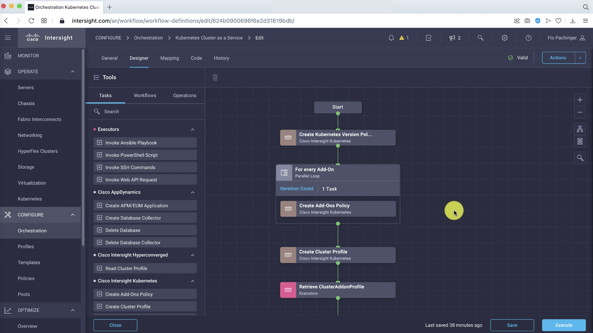
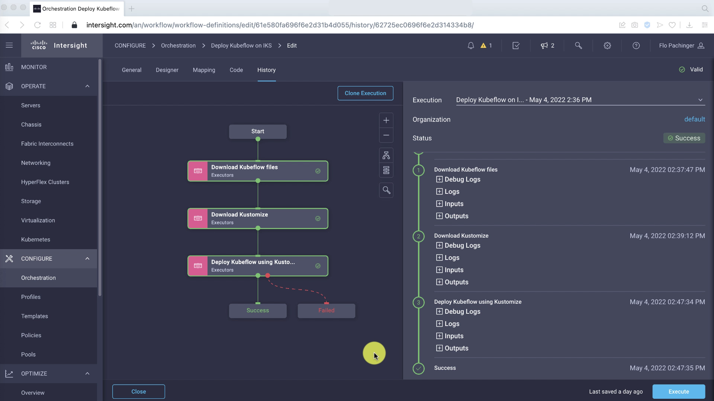
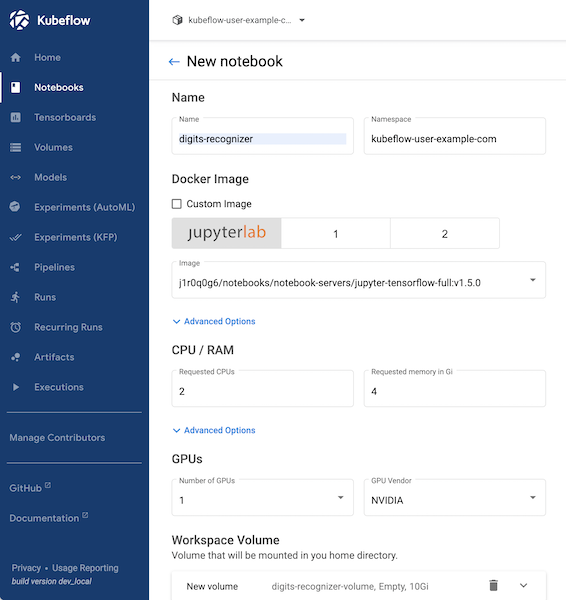

# Recognizing digits with Kubeflow on Cisco IKS

Deploy Kubeflow on Cisco Intersight and create a ML pipeline for a digit recognizer application.

**Steps**:

* Create Kubernetes Cluster from scratch with Cisco Intersight
* Deploy Kubeflow 1.5 with Cisco Intersight
* Access Kubeflow UI
* Create Jupyter Notebook and use it to explore the digit recognizer application
* Create a ML pipeline with Kubeflow Pipelines
* Create a simple web-application to mouse-draw the digits with Javascript + HTML5 canvas
* Serve the model with Kserve

**Components**:

* Cisco Intersight
* Kubeflow 1.5
* Kubernetes 1.21
* Hardware: Cisco UCS Server

## 1. Deploy Kubernetes Cluster with Cisco Intersight

[Watch an introduction to Intersight Kubernetes Service](https://www.youtube.com/watch?v=wxQRDwRO4-Y)

We will use the Intersight Kubernetes Service (IKS) to build the Kubernetes cluster and the Intersight Cloud Orchestrator (ICO) to write a deployment workflow for Kubeflow.
IKS allows you to build 100% upstream Kubernetes clusters with all necessary services for production. Monitoring comes out of the box, networking and ingress load balancers are already set up and service mesh management is already included.



## 2. Install Kubeflow with ICO

Now that we have the cluster, we can write our deployment in ICO. We are going to do a custom installation using Kubeflow version 1.5. To do this, we will need a copy of the Kubeflow GitHub repository. We can then build our own yaml files using kustomize, which we can then apply to our Kubernetes cluster. Our ICO workflow mirrors these same three steps.



> **Watch the whole process in [this video](https://www.youtube.com/watch?v=saRVAFM6H6I)!**

## 3. Access the Kubeflow Central Dashboard

Once you have everything deployed, you can do a port-forward with

```
kubectl port-forward svc/istio-ingressgateway -n istio-system 8080:80
```

and access the Kubeflow Central Dashboard remotely at [http://localhost:8080](http://localhost:8080).


## 4. Setup Jupyter Notebooks

### Allow access to Kubeflow Pipelines from Jupyter Notebooks

In this demo you will access the Kubeflow Pipeline via the Python SDK in a Jupyter notebook. Therefore, one additional setting is required to allow this.

At first insert your Kubeflow username in this Kubernetes manifest (your Kubeflow username is also the name of a Kubernetes namespace where all your user-specific containers will be spun up): [kubeflow_config/access_kfp_from_jupyter_notebook.yaml](kubeflow_config/access_kfp_from_jupyter_notebook.yaml).

Once done, apply it with this command:

```
kubectl apply -f access_kfp_from_jupyter_notebook.yaml
```

### Spinning up a new Notebook Instance

Now, you need to spin a up new Jupyter notebook instance. For the container image select **jupyter-tensorflow-full:v1.5.0**. This can take several minutes depending on your download speed.



Don't forget to enable this configuration:


### Cloning the code from Github & exploring the dataset

With Juypter Lab you have access to a terminal and Python notebook in your web browser. This is where your data science team and you can collaborate on exploring that dataset and also create your Kubeflow Pipeline.

At first, let's clone this repository so you have access to the code. You can use the terminal or directly do that in the browser.

```
git clone https://github.com/flopach/digits-recognizer-kubeflow-intersight
```


Then open `digits_recognizer_explore.` to get a feeling of the [dataset](http://yann.lecun.com/exdb/mnist/) and its format.

## Setup MinIO for object storage

In order to provide a single source of truth where all your working data (training and testing data, saved ML models etc.) is available to all your components, using an object storage is a recommended way. For our app, we will setup [MinIO](https://min.io).

Since Kubeflow has already setup a MinIO tenant, we will leverage the **mlpipeline bucket**. But you can also deploy your own MinIO tenant.

### Get credentials from Kubeflow's integrated MinIO

1. Obtain the accesskey and secretkey for MinIO with these commands:

```
kubectl get secret mlpipeline-minio-artifact -n kubeflow -o jsonpath="{.data.accesskey}" | base64 --decode
```

```
kubectl get secret mlpipeline-minio-artifact -n kubeflow -o jsonpath="{.data.secretkey}" | base64 --decode
```

2. In order to get access to MinIO from outside of your Kubernetes cluster and check the bucket, do a port-forward:

```
kubectl port-forward -n kubeflow svc/minio-service 9000:9000
```

3. Then you can access the MinIO dashboard at [http://localhost:9000](http://localhost:9000) and check the bucket name or create your own bucket. Alternatively, you can use the [MinIO CLI Client](https://docs.min.io/docs/minio-client-quickstart-guide.html)

**Default** values should be (already in the code):

* accesskey: **minio**
* secretkey: **minio123**
* bucket: **mlpipeline**

## Get started with Kubeflow Pipelines

Kubeflow Pipelines (KFP) is the most used component of Kubeflow. It allows you to create for every step or function in your ML project a reusable containerized pipeline component which can be chained together as a ML pipeline.

For the digits recognizer application, the pipeline is already created with the Python SDK. You can find the code in the file `digits_recognizer_kfp.`

## Creating the digits recognizer web application

You can find the digits recognizer app in the folder `web_app`.


## Serving the ML model with Kserve

`kubectl -n knative-serving edit configmap config-deployment`

Change to:

```
apiVersion: v1
data:
  registriesSkippingTagResolving: "index.docker.io"
  _example: |
    ################################
    #                              #
    #    EXAMPLE CONFIGURATION     #
    #                              #
    ################################
```

Find more here: https://kserve.github.io/website/developer/debug/#inference-service-fails-to-start 

_work in progress_


